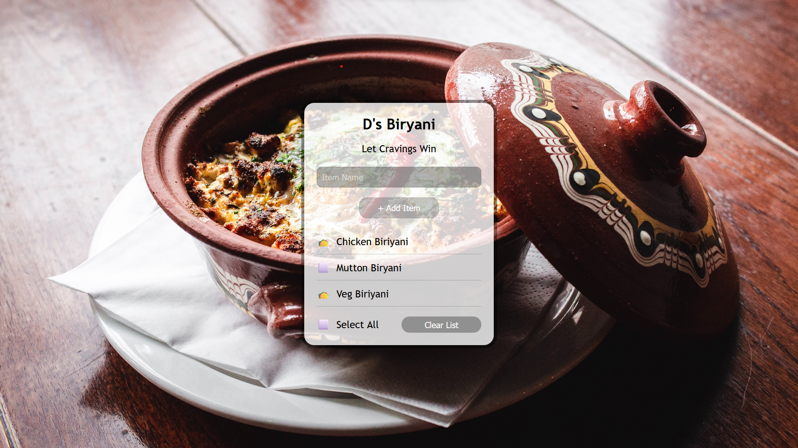

# LocalStorage

## Table of contents

- [Overview](#overview)
  - [The challenge](#description)
  - [Screenshot](#screen-shot)
  - [Links](#solution-and-live-site)
  - [Built with](#built-with)
- [Author](#author)

## Description
This project is a hotel meals ordering system that makes use of local storage. It allows users to order meals and stores the order details in the local storage for future reference.

## Screen Shot

## Solution and Live site 

- Live Site : [Click for website](https://www.github.com/Ashraful-Fuqha/Local-Storage/)
- Solution : [Click for website](https://ashraful-fuqha.github.io/local-storage/)

## Features
- Order meals: Users can select meals and add them to their order.
- Local storage: The system stores order details in the local storage.

## Built with 
- HTML5
- CSS3
- Vanilla JS
- Local Storage of browser

## Author

- GitHub : [@MjafarsadiqD](https://github.com/Ashraful-Fuqha)